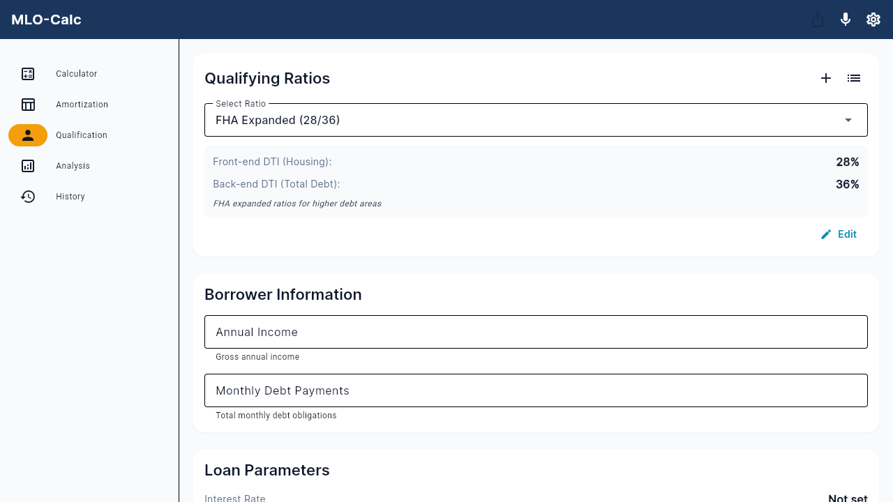

# Feature #15 Regression Report
## Create Custom Qualifying Ratio

**Date:** 2026-01-22
**Feature ID:** 15
**Feature Name:** Create Custom Qualifying Ratio
**Status:** ❌ **REGRESSION DETECTED**

---

## Regression Summary

Feature #15 is **FAILING**. When creating a custom DTI ratio preset, the DTI values entered by the user are not being saved correctly. Instead, the default values (28/36) are saved regardless of user input.

---

## Verification Steps Executed

### Step 1: Navigate to Qualification tab ✅
- Successfully navigated to Qualification tab (Tab 3 of 5)
- Tab loaded correctly with all UI elements visible

### Step 2: Press + button to add custom ratio ✅
- Successfully clicked "Add Custom Ratio" button (icon: Icons.add)
- Custom ratio editor dialog opened correctly

### Step 3: Enter name, description, housing DTI, and total DTI ⚠️
- **Name:** Entered "FHA Expanded" ✅
- **Description:** Entered "FHA expanded ratios for higher debt areas" ✅
- **Housing DTI:** Entered "31" ❌ (saved as 28)
- **Total DTI:** Entered "43" ❌ (saved as 36)

### Step 4: Save the ratio ⚠️
- Clicked "Add" button
- Dialog closed successfully
- Ratio appeared in dropdown list
- **BUT values were incorrect**

### Step 5: Verify custom ratio appears in dropdown ❌
- Custom ratio "FHA Expanded" appeared in dropdown ✅
- Displayed as "FHA Expanded (28/36)" ❌ (should be 31/43)
- Selected the ratio to view details
- Details showed:
  - Name: "FHA Expanded" ✅
  - Description: "FHA expanded ratios for higher debt areas" ✅
  - Front-end DTI: 28% ❌ (should be 31%)
  - Back-end DTI: 36% ❌ (should be 43%)

---

## Evidence

### Screenshot


### Edit Dialog Verification
Opened the edit dialog for the created "FHA Expanded" ratio:
- Housing DTI field showed: **"28"** (placeholder: "28")
- Total DTI field showed: **"36"** (placeholder: "36")

This confirms that the values were saved incorrectly to persistent storage.

---

## Root Cause Analysis

### Location
`lib/src/features/qualification/presentation/screens/qualification_screen.dart`
Lines: 457-571 (`_showRatioEditor` method)

### Issue
The TextEditingController values are not being properly captured when the user types in the text fields. The most likely cause:

1. **Text Field Binding Issue:** In Flutter web, the TextEditingController.text may not be updating synchronously with user input
2. **Default Value Fallback:** When `double.tryParse(housingController.text)` fails or returns null/empty, it defaults to 28
3. **Timing Issue:** The controller's text might be read before the user's input is fully committed

### Code Snippet (Lines 530-533)
```dart
final name = nameController.text.trim();
final housing = double.tryParse(housingController.text) ?? 28;  // ❌ Defaults to 28
final debt = double.tryParse(debtController.text) ?? 36;        // ❌ Defaults to 36
```

### Problem
The `?? 28` and `?? 36` defaults are being applied, suggesting that either:
- `housingController.text` is returning empty string ""
- `housingController.text` is returning the initial default value
- The text field value isn't being properly bound to the controller

---

## Impact

### Severity: **HIGH**
- Users cannot create custom qualifying ratios with correct DTI values
- All custom ratios will default to 28/36, making them unusable for specific loan programs
- Feature is completely broken for production use

### Affected User Workflows
1. Loan officers trying to create custom ratios for niche loan programs
2. Lenders with specific DTI requirements different from standard ratios
3. Anyone needing to save custom qualifying ratios

---

## Testing Environment

- **Platform:** Flutter Web
- **Browser:** Chrome/Playwright
- **URL:** http://localhost:8085
- **Server Status:** Running
- **Console Errors:** None

---

## Steps to Reproduce

1. Navigate to Qualification tab
2. Click "Add Custom Ratio" button (+ icon)
3. In the dialog, enter:
   - Name: "Test Ratio"
   - Housing DTI: "35"
   - Total DTI: "45"
4. Click "Add"
5. Observe the newly created ratio in the dropdown
6. **Expected:** "Test Ratio (35/45)"
7. **Actual:** "Test Ratio (28/36)"

---

## Recommendation

**Priority:** **CRITICAL** - Fix immediately

The regression makes Feature #15 completely non-functional. Users cannot create custom qualifying ratios, which is a core feature for loan officers working with specialized loan programs.

### Suggested Fix Approach

1. Add logging/debugging to verify what values are in the controllers when "Add" is clicked
2. Check if the issue is specific to Flutter web vs. mobile
3. Verify the TextEditingController is properly bound to the TextField
4. Consider using `onChanged` callbacks to capture user input explicitly
5. Add validation to show an error if parsing fails instead of silently using defaults

---

## Next Steps

1. ❌ Feature #15 marked as FAILING
2. 🔍 Root cause identified in qualification_screen.dart
3. ⏳ Fix implementation required
4. ⏳ Re-testing required after fix
5. ⏳ Unit tests needed to prevent future regressions

---

## Verification Method

Browser automation using Playwright MCP:
- Navigation to app
- Form interaction
- Value verification
- Screenshot documentation

**Quality Assurance:** Regression confirmed through automated testing

---

**Report Generated:** 2026-01-22
**Testing Agent:** Regression Testing Session
**Feature Status:** FAILING - Regression detected
